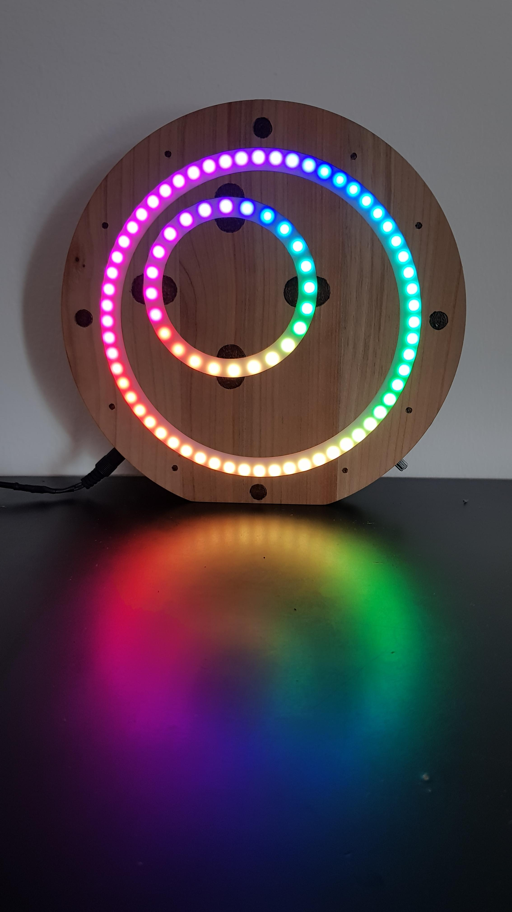

# LEDura - clock using Arduino and LED rings

Build your own following instructions on: https://www.instructables.com/id/LEDura-Analog-LED-Clock/

* LEDclock --> code for programing Arduino
* Library --> libraries that I use
* ProgeCAD --> .step file for 3D modeling
* TinkerCad --> link to project

<!--  -->
